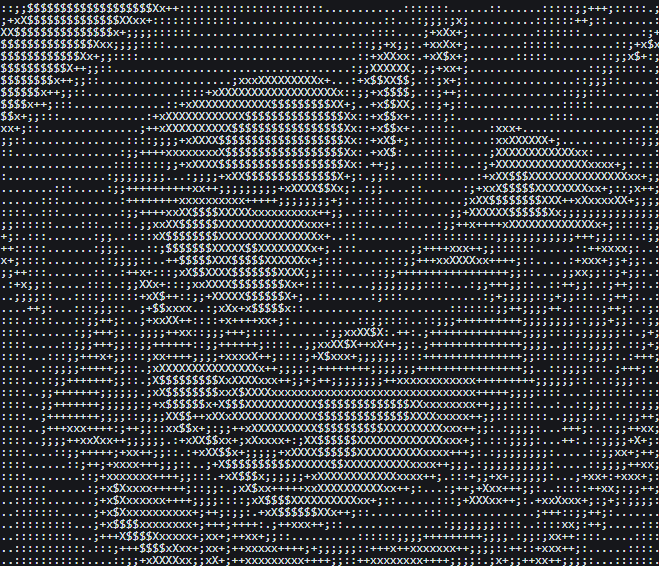
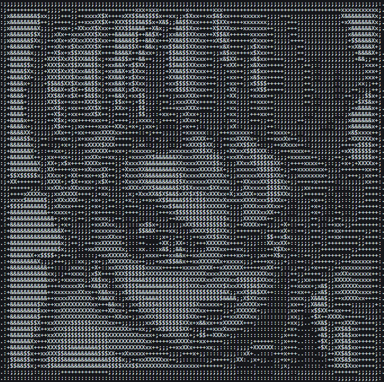
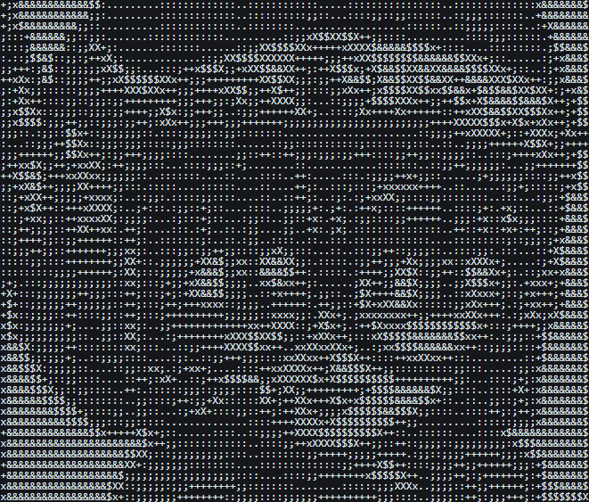

# Em-Busca-do-Baralho-Proibido_RPG_C

## RPG de combate por turnos no terminal

### Sobre

Jogo de RPG por turnos no terminal inspirado em Yu-Gi-Oh! e Chrono Trigger. O jogador enfrenta três inimigos em sequência para conquistar o Baralho Proibido, desafiado por Pegasus.

### Como compilar e rodar

- Entre na pasta do projeto
- Execute: make
- Execute: ./baralho_proibido

### Personagens

**Crono**

| HP  | ATK | DEF | Speed |
| --- | --- | --- | ----- |
| 120 | 20  | 10  | 15    |

**Marie**

| HP  | ATK | DEF | Speed |
| --- | --- | --- | ----- |
| 140 | 16  | 16  | 11    |

**Lucca**

| HP  | ATK | DEF | Speed |
| --- | --- | --- | ----- |
| 100 | 26  | 8   | 13    |
