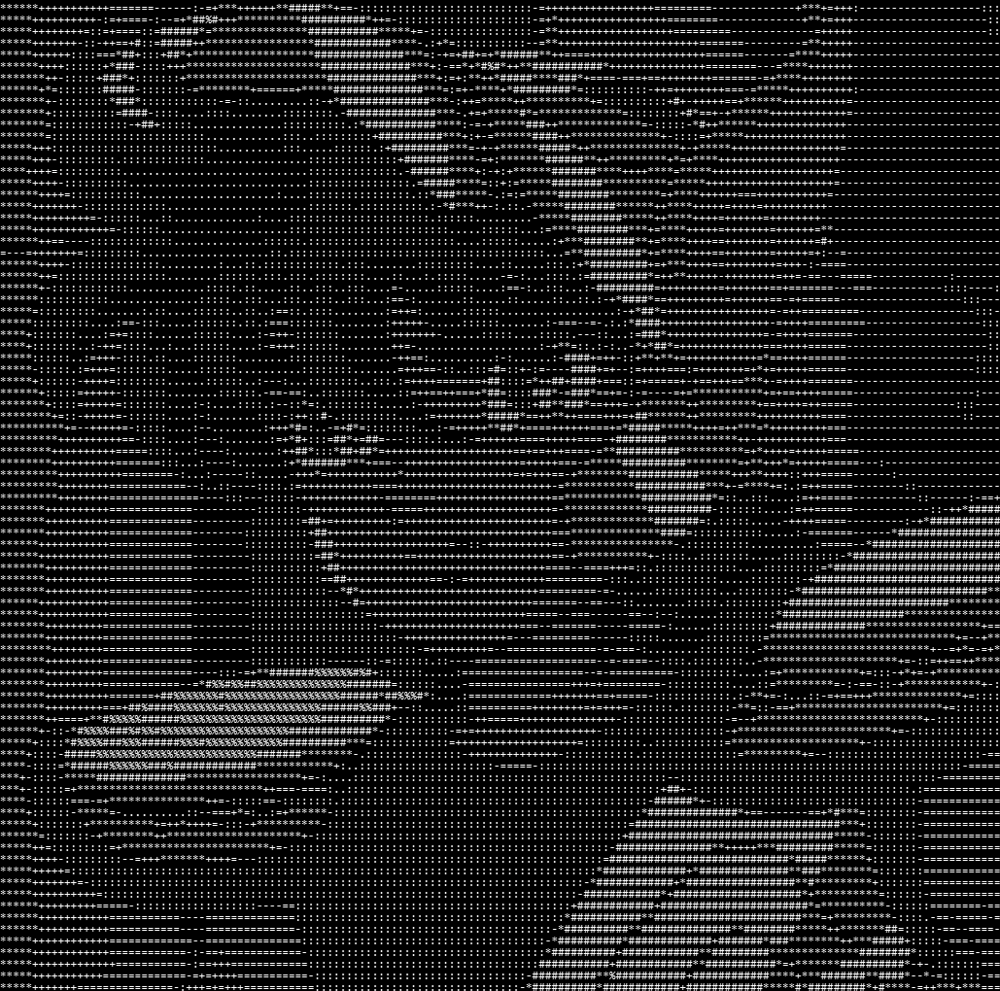
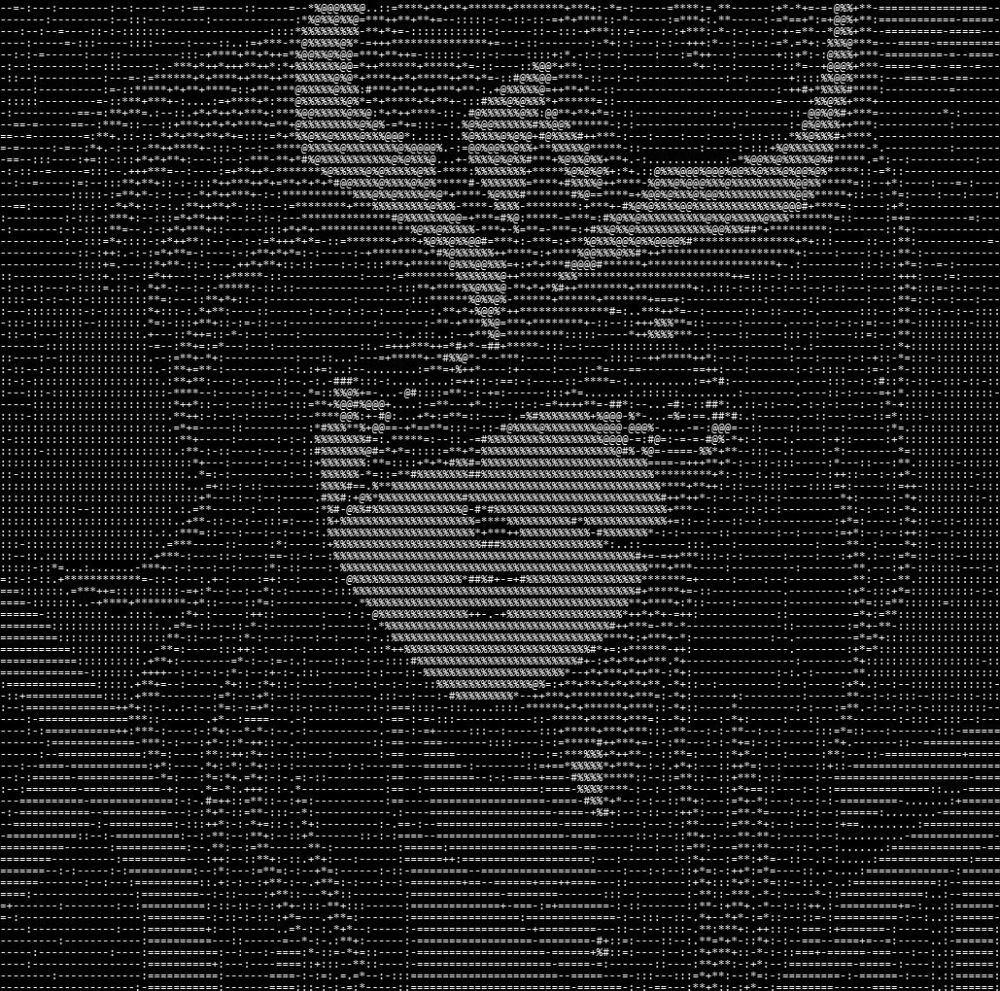
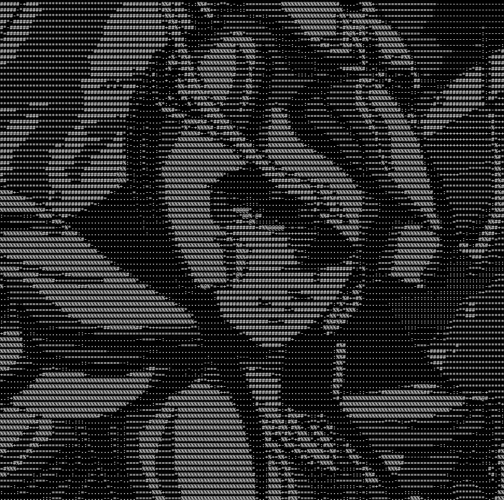
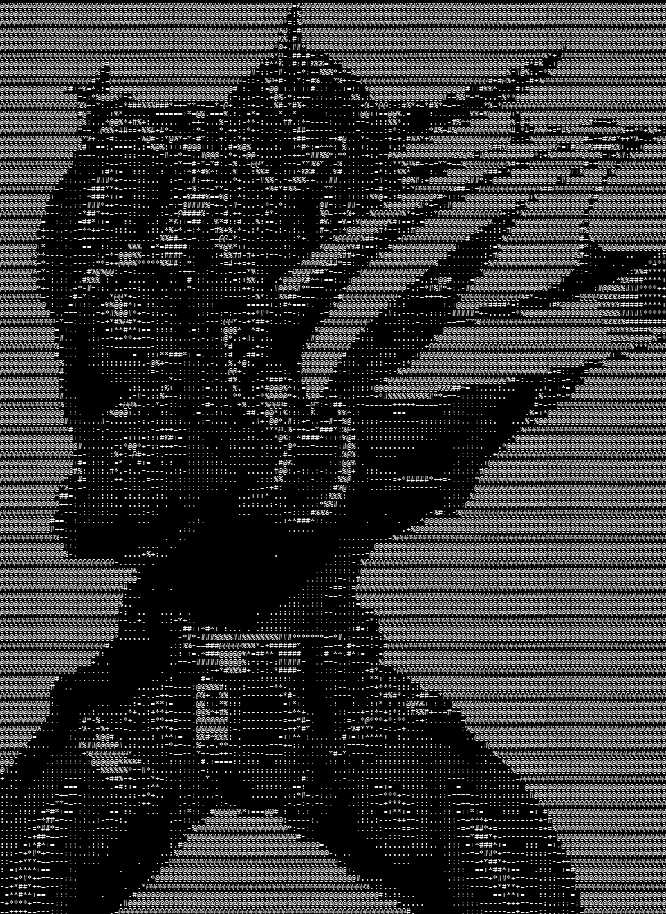
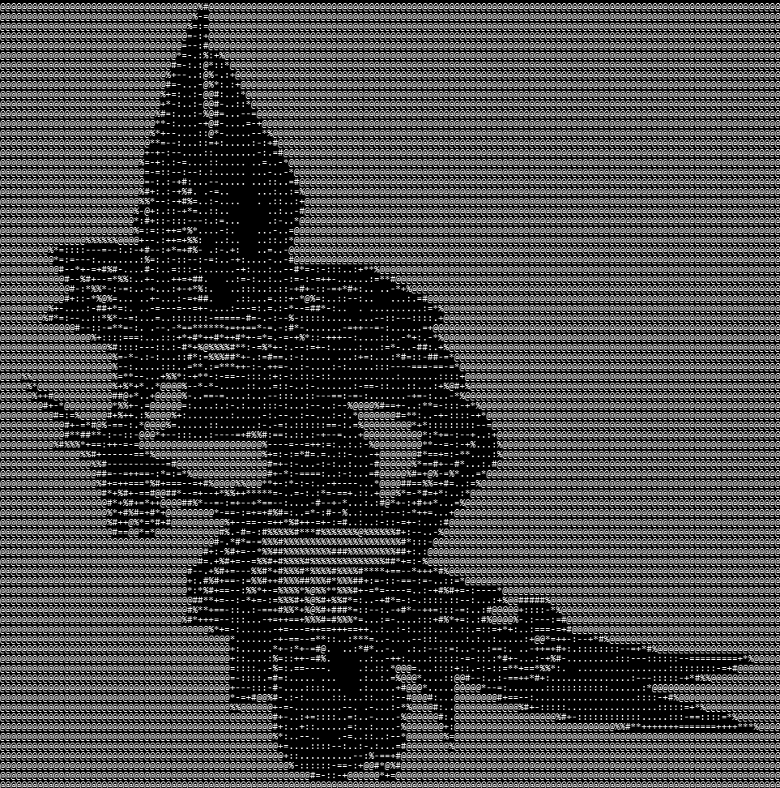
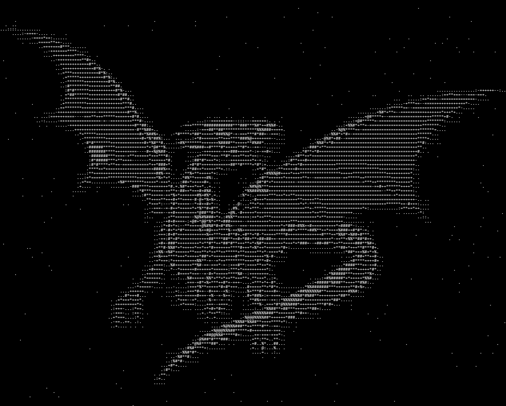

# Em-Busca-do-Baralho-Proibido_RPG

Jogo de RPG por turnos no terminal inspirado em Yu-Gi-Oh! e Cavaleiros do Zodíaco, feito em C puro para a disciplina de Algoritmos e Estrutura de Dados. O jogo usa três estruturas de dados para resolver problemas reais de um sistema de combate: **fila circular**, **pilha** e **grafo**.

## Sobre

O jogador escolhe um dos três Cavaleiros de Bronze (Seiya, Shun ou Shiryu), cada um com atributos diferentes, e enfrenta três fases de combate contra inimigos com comportamentos próprios: Touro Guerreiro, Mago Negro e Dragão Branco de Olhos Azuis. Cada inimigo reage de forma diferente dependendo do HP dele e do jogador, graças à FSM que controla suas decisões. O jogador vence o RPG se conseguir enfrentar os 3 inimigos em sequencia sem morrer.

## Personagens

**Seiya**



| HP  | ATK | DEF | Speed |
| --- | --- | --- | ----- |
| 150 | 25  | 10  | 15    |

**Shun**



| HP  | ATK | DEF | Speed |
| --- | --- | --- | ----- |
| 180 | 20  | 16  | 11    |

**Shiryu**



| HP  | ATK | DEF | Speed |
| --- | --- | --- | ----- |
| 120 | 30  | 8   | 13    |

## Inimigos

**Touro Guerreiro**



| HP  | ATK | DEF | Speed |
| --- | --- | --- | ----- |
| 170 | 22  | 8   | 12    |

**Mago Negro**



| HP  | ATK | DEF | Speed |
| --- | --- | --- | ----- |
| 250 | 18  | 14  | 10    |

**Dragão Branco de Olhos Azuis**



| HP  | ATK | DEF | Speed |
| --- | --- | --- | ----- |
| 300 | 28  | 15  | 8     |

## Estrutura de Dados

### Fila circular de turnos (`queue.c` / `queue.h`)

A fila decide quem age em cada turno, ordenando os personagens por velocidade (`spd`). Implementada como um buffer circular de tamanho fixo (`QUEUE_MAX`), com `front` e `size` controlando a posição lógica sem precisar deslocar todo o array. A ideia de utilizar a fila é justamente por atender ao modelo de turnos que um rpg exige.

#### Funções principais:

- `insertqueue`: insere um personagem na posição correta (por velocidade), abrindo espaço via rotação circular.
- `queue_peek`: consulta quem age agora, sem remover.
- `queue_cycle`: quem acabou de agir volta para o fim da fila.

### Pilha de histórico (`stack.c` / `stack.h`)

Guarda cada evento de combate em ordem cronológica. Ao final da batalha, o histórico é desempilhado (LIFO) e mostrado do evento mais recente para o mais antigo na tela de vitória.

- `stack_push` / `stack_pop`: operações padrão de pilha, com array fixo (`STACK_MAX`) e strings de tamanho limitado (`STACK_MSG_LEN`).

### Grafo de estados (FSM) para IA dos inimigos (`fsm.c` / `fsm.h` / `enemies.c`)

Cada inimigo é um grafo: os nós são estados (`ATACAR`, `ATAQUE FORTE`, `DEFENDER`) e as arestas são transições condicionais com prioridade. A cada turno, o inimigo percorre a lista de arestas do seu estado atual (ordenada por prioridade) e segue a primeira cuja condição seja satisfeita. Isso é exatamente o sistema que os inimigos do pac-man, por exemplo.

#### Funções principais:

- `fsm_add_edge`: insere arestas numa lista ligada por nó, mantendo ordem decrescente de prioridade.
- `fsm_update`: percorre as arestas do estado atual e aplica a primeira condição verdadeira.
- Condições (`cond_self_hp_below_30`, `cond_player_hp_below_50` etc.) ficam em `enemies.c` e decidem o comportamento de cada chefe. Uma melhora possível seria colocar condições mais complexas, como combinações de atributos e situações específicas.

## Estrutura do repositório

```
EM-BUSCA-DO-BARALHO-PROIBIDO_RPG/
├── include/          # headers (character, combat, enemies, fsm, queue, stack, story, ui, ascii)
├── src/              # implementação de cada função
│   ├── ascii.c       # artes ASCII
│   ├── character.c   # criação e dano de personagens
│   ├── combat.c      # loop principal de combate
│   ├── enemies.c      # criação dos inimigos e suas FSMs
│   ├── fsm.c         # motor genérico de máquina de estados
│   ├── main.c        # ponto de entrada, fluxo das fases
│   ├── queue.c        # fila circular de turnos
│   ├── stack.c        # pilha de histórico
│   └── story.c        # telas de narrativa
├── images/ # isso aqui serve exclusivamente para o README, não é usado no jogo
    ├── seiya_ascii.png
    ├── shun_ascii.png
    └── shiryu_ascii.png
├── makefile
└── README.md
```

## Como compilar e rodar

O projeto usa um `makefile` simples, com dois alvos: `all` (compila) e `clean` (remove o executável).

no terminal da raiz do projeto, rode:

```bash
make          # compila e gera o executável RPG
./RPG         # roda o jogo (no Windows: RPG.exe)

make clean    # se quiser, depois, use este comando que remove o executável gerado
```

## Fluxo do jogo

1. Tela de título e seleção de personagem.
2. Introdução com narração de acordo com o cavaleiro escolhido.
3. Três fases de combate, cada uma com um inimigo diferente e sua própria FSM.
4. Ao vencer todas as fases, o histórico completo da jornada é exibido. Se o jogador morrer em qualquer fase, a tela de Game Over encerra o jogo.

## Melhorias Futuras

- Deixar o combate visualmente mais atrativo, semelhante a um RPG mesmo, com a imagem do inimigo e as costas do personagem na tela, e não apenas o texto.
- Adicionar mais FSMs para os inimigos, deixando cada um com comportamento único e mais complexo.
- Adicionar mecânica de cura.
- Adicionar mais personagens jogaveis(hyoga e ikki), fechando o grupo dos cavaleiros.
- Adicionar algum tipo de limitação ou cooldown do ataque forte, para o jogador ou o inimigo nao fique "spammando" o ataque mais.
